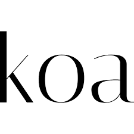

# Hi, I'm Kier 👋🏻

I'm a passionate Full Stack Developer with a diverse technical skill set.

I love experimenting with new technologies and working on impactful projects.

## Tools I use:

## Projects I'm Currently Working On:

### [Goss](https://github.com/kmoze/goss)

A voice-note focused social media app built in Next.js, using mobile-first design principles. The backend is built using Supabase. Group project as part of Codeworks bootcamp. I built the notifications and follow features. Here's a demo video I cut together of the app:
[YouTube link](https://www.youtube.com/watch?v=B67vE1EfjiQ)

### [MigrainePal](https://github.com/kmoze/migraine_pal)

MigrainePal is a tracking tool that enables users to log their migraine attacks, receive detailed analytics and insights about them all with the goal of providing the end user with a deeper understanding of their migraine condition.

Here's a demo of MigrainePal: [YouTube link](https://youtu.be/kwPL03Xq2R0)

## Past projects

### [Atomize Pro](https://github.com/kmoze/refactored-atomize)

A fork of Atomize, a todo app built in React. Converted the codebase to TypeScript, and refactored the entire state management approach, implementing global context and useReducer, removing 13 useEffects, 21 state variables, and fixing a number of significant bugs that were causing unintended behaviour, particularly with asynchronous state. Applied Vitest test suite to the project codebase.

<!--
- 🔭 I’m currently working on...
- 🌱 I’m currently learning ...
- 👯 I’m looking to collaborate on ...
- 🤔 I’m looking for help with ...
- 💬 Ask me about ...
- 📫 How to reach me: ...
- 😄 Pronouns: ...
- ⚡ Fun fact: ...
  -->
